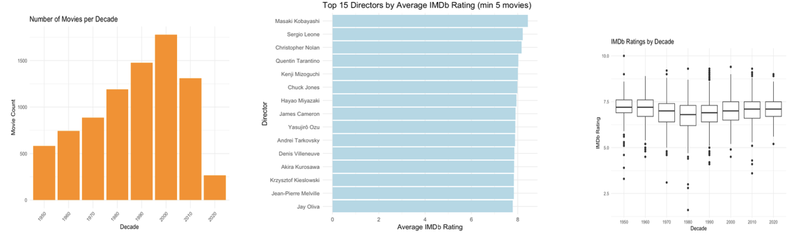

# Flickchart Movie Scraper & Analysis

Scrape and enrich **10k+ movies from Flickchart** with additional data from **IMDb (OMDb API)**, **Wikipedia**, and **TMDb API** — all in **R**.  
The pipeline produces a rich dataset including titles, year, director, cast, genre, duration, ratings, budgets, revenues, and calculated profits.  
On top of scraping, the project also includes an **R Markdown report**(FinalProject.Rmd) with exploratory analysis and visualizations.

---

## Features
- Scrapes:
  - **Title, Year, Duration, Genre, Director, Cast** from Flickchart
- Fetches:
  - **IMDb Ratings** (via OMDb API, with fallbacks)
  - **Budget & Box Office** (via Wikipedia infobox parsing)
  - **Budget & Revenue** (via TMDb API)
- Cleans financial data into **USD** and computes **profit percentage**
- Provides **exploratory analysis** with plots:
  - IMDb ratings by decade
  - Top directors and their rating distributions
  - Genre and runtime trends across decades
  - Actor frequency, rating distributions, and career trajectories
  - Sequel/reboot rating trends
  - Word clouds for actors and directors
  - Profitability estimates

---

## Output Dataset:  
- **`movies_info.csv`** – fully enriched dataset with external APIs  

**Columns in final dataset:**
- `title`, `year`, `director`, `duration`, `cast`, `genre`
- `imdb_rating`
- `budget`, `box_office` (raw Wikipedia strings)
- `tmdb_budget`, `tmdb_revenue` (numeric from TMDb)
- `budget_usd`, `revenue_usd` (cleaned USD values, best source chosen)
- `profit_percent` = `(revenue_usd - budget_usd) / budget_usd * 100`

---

## R Markdown Analysis (`Final_Project.Rmd`)

The **Rmd file** (`Final_Project.Rmd`) builds upon the enriched dataset and produces insights via visualizations and commentary.  
Key components include:

### Temporal Trends
- **Number of movies per decade**
- **IMDb ratings by decade** (boxplots)
- **Runtime evolution across decades**
- **Average runtime by genre**

### Director Analysis
- **Top 15 directors by IMDb rating** (bar plots & boxplots)
- **Genre specialization vs. diversity**
- **Diversity vs. consistency plots**
- **Word clouds of directors (by frequency & average rating)**

### Genre Analysis
- **Top genres by decade** (line trends)
- **Ratings vs. runtime by genre**

### Actor Analysis
- **Most frequent actors** (bar plot)
- **Top actors by IMDb rating** (bar plot & boxplots)
- **Actor career trajectories across decades**
- **Word cloud of actors (frequency & ratings)**

### Sequels & Reboots
- **IMDb rating trends across sequel numbers**
- **Boxplots of sequels with annotated medians**
- **Reboots with same title and their rating trends**

### Financial Analysis
- **Wikipedia + TMDb budget/revenue integration**
- **Profit percentage estimates**
- **Patterns in high-profit vs. low-profit films**

---

## Visualisations


The rest of the visualisations are uploaded as Fig2, Fig3, Fig4, Fig5 and Fig6

## Report

The full write-up of this project is available here:  
[A Cinematic Journey through Data (PDF)](FinalReport.pdf)


## 🛠 Requirements
Install required R packages:
```r
install.packages(c(
  "rvest", "dplyr", "readr", "stringr", "purrr",
  "tidyr", "httr", "jsonlite", "ggplot2", 
  "wordcloud", "wordcloud2", "RColorBrewer", "scales"
))
